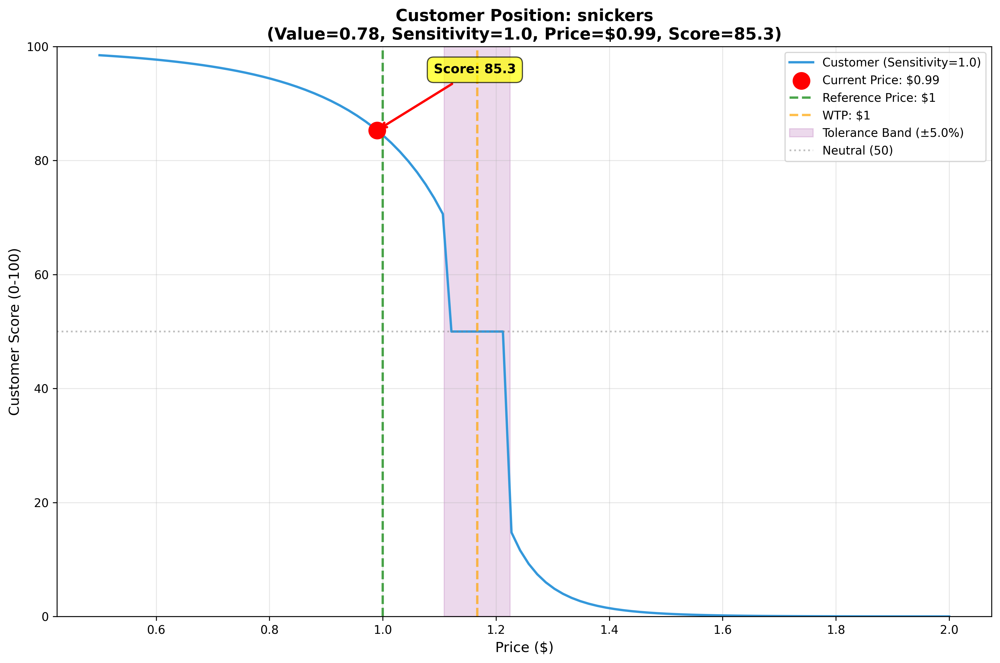
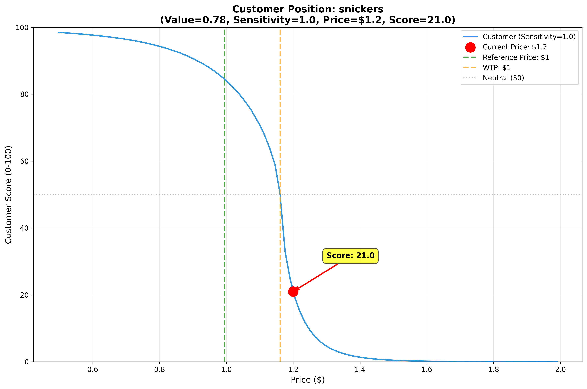

# Price Sensitivity Model

A behavioral economics model that simulates customer decision-making when evaluating products. The model incorporates key psychological principles to predict customer scores based on product features and pricing.

## Example Visualizations

The charts below show the price sensitivity curves for two different scenarios. The customer has seen three historical prices: $0.95, $1.00, and $1.05 (median = $1.00, MAD ≈ 5%).

### Example 1: Discounted Price ($0.99 vs $1.00 reference)



- **Product price:** $0.99 (1% below reference)
- **WTP (Willingness to Pay):** Based on value perception
- **Tolerance band:** Purple shaded region (±5% around WTP)
- **Result:** Score ~85.3 - good price relative to perceived value
- **Key lines:**
  - Green dashed: Reference price (median of historical prices)
  - Orange dashed: WTP (what customer is willing to pay based on product value)
  - Purple shaded: Tolerance band (prices within this zone feel "about the same")

### Example 2: Premium Price ($1.20 vs $1.00 reference)



- **Product price:** $1.20 (20% above reference)
- **WTP:** Based on value perception
- **Tolerance band:** ±5% around WTP
- **Result:** Score ~50.0 - price falls within tolerance band, perceived as neutral
- **Key observation:** Note the steeper drop on the right side of the curve compared to the left - this asymmetry demonstrates loss aversion (overpricing hurts 2× more than discounts feel good)

### What These Charts Show

Both examples demonstrate:
- **S-shaped curve** from sigmoid transformation - realistic customer response
- **Asymmetric response** - the curve drops more steeply for overpricing (right side) than it rises for discounts (left side)
- **Reference price anchoring** (green line) - customer expectations based on past prices
- **WTP calculation** (orange line) - adjusts based on perceived product value
- **Tolerance band** (purple shading) - price differences within ~5% of WTP are perceived as negligible
- **Loss aversion** - prices outside the tolerance band on the high side cause dramatic score drops

## Psychological Features Modeled

### 1. Reference Price Effect
Customers don't evaluate prices in isolation - they compare against a **reference price** formed from past experiences.

**Implementation:**
- Stores customer memory of previously seen products
- Calculates reference price as the **median** of historical prices
- Uses Median Absolute Deviation (MAD) to measure price uncertainty

```python
ref_price = median(historical_prices)
rel_uncertainty = MAD / ref_price
```

### 2. Willingness-to-Pay (WTP) Calibration
Customer's willingness to pay is based on perceived value, with asymmetric behavior around the reference point.

**Implementation:** Piecewise linear function with a pivot at value = 0.5

**Below Average (value ≤ 0.5):**
```python
wtp = ref_price × (value × 2.0)
```
- Maps value range [0, 0.5] to WTP [0%, 100%] of reference price
- Products below expectations face steep discounting

**Above Average (value > 0.5):**
```python
max_premium = 0.6 / price_sensitivity
wtp = ref_price × (1.0 + max_premium × (value - 0.5))
```
- Maps value range [0.5, 1.0] to WTP [100%, 100% + premium]
- Premium is controlled by customer's price sensitivity
- Example: At sensitivity = 1.0, max premium = 30% for perfect products

### 3. Price Tolerance Band
Small price differences within normal market variability go unnoticed by customers.

**Implementation:**
```python
if abs(rel_delta) < rel_uncertainty:
    rel_delta = 0  # Treat as equal to market price
```

This models **Weber-Fechner Law** - customers only notice price differences beyond a threshold based on historical variability.

### 4. Loss Aversion
Negative price differences (overpricing) hurt more than positive differences (discounts) feel good.

**Implementation:** Asymmetric response with 2× penalty for losses
```python
if rel_delta >= 0:  # Good deal
    feeling = rel_delta^0.65
else:  # Bad deal
    feeling = -2 × ((-rel_delta)^0.65)
```

**Why the exponent 0.65?**
- Models **diminishing marginal utility**
- Going from 10% → 20% discount doesn't feel twice as good
- Reflects real human psychology where additional savings have decreasing impact

**Why the 2× multiplier?**
- Implements **loss aversion** from prospect theory (Kahneman & Tversky)
- Customers feel pain of overpricing roughly 2× stronger than pleasure of equivalent discount

### 5. Sigmoid Score Transformation
The final score uses a sigmoid function to create smooth, bounded scores.

**Implementation:**
```python
k_eff = 6.0 × price_sensitivity
score = 100.0 / (1.0 + exp(-k_eff × feeling))
```

This creates:
- **S-shaped response curve** - realistic customer behavior
- Scores bounded between 0-100
- Price sensitivity controls the steepness of the curve

### 6. Feature-Based Value Perception
Product value is calculated using L1 distance between product features and customer preferences.

**Implementation:**
```python
distance = sum(abs(pref - feat) for pref, feat in zip(preferences, features))
value = 1.0 - (distance / max_distance)
```

- Perfect feature match → value = 1.0
- Maximum distance → value = 0.0

### 7. Memory-Based Learning
Customers build reference prices from experience, using similar products when exact matches aren't available.

**Implementation:**
- Hierarchical memory: category → SKU → price/feature history
- Falls back to similar products (80%+ feature similarity) in same category
- Defaults to pure value-based scoring if no reference exists

## Usage

### Basic Example
```python
from model import Customer, Product

# Create customer with preferences
customer = Customer(
    preferences=[5, 5, 5],
    max_distance=27,
    price_sensitivity=1.0
)

# Add reference product to memory
ref_product = Product(price=1.0, sku="snickers", category=1, features=[5, 5, 5])
customer.append_memory(ref_product)

# Evaluate a new product
test_product = Product(price=0.85, sku="snickers", category=1, features=[5, 5, 5])
score = customer.eval_product(test_product, chart=False, update_mem=True)
print(f"Score: {score:.2f}")
```

### Visualization (Debug Mode)
```python
# Generate visualization chart
score = customer.eval_product(test_product, chart=True, update_mem=True)
```

**WARNING:** `chart=True` is computationally expensive (100+ score calculations per chart). Use only for debugging/visualization, not in production.

## Parameters

### Customer Parameters
- **preferences**: `list[int]` - Ideal product features
- **max_distance**: `float` - Maximum L1 distance for normalization
- **price_sensitivity**: `float` (default: 1.0)
  - Higher values = more price-sensitive customers
  - Lower values = less price-sensitive, willing to pay higher premiums
  - Affects both WTP premium calculation and score steepness

### Product Parameters
- **price**: `float` - Product price
- **sku**: `str` - Stock keeping unit identifier
- **category**: `int` - Product category
- **features**: `list[int]` - Product feature vector

## Key Equations Summary

| Concept | Equation | Purpose |
|---------|----------|---------|
| Reference Price | `median(prices)` | Anchoring point |
| Price Uncertainty | `MAD / median` | Tolerance band |
| WTP (low value) | `ref × (value × 2.0)` | Discount zone |
| WTP (high value) | `ref × (1 + 0.6/sens × (v-0.5))` | Premium zone |
| Price Delta | `(wtp - price) / wtp` | Relative difference |
| Good Feeling | `delta^0.65` | Diminishing returns |
| Bad Feeling | `-2 × ((-delta)^0.65)` | Loss aversion |
| Final Score | `100 / (1 + exp(-k × feeling))` | Sigmoid transform |

## Behavioral Economics Principles

1. **Prospect Theory** - Loss aversion asymmetry
2. **Reference Dependence** - Prices judged relative to anchors
3. **Weber-Fechner Law** - Just noticeable difference thresholds
4. **Diminishing Marginal Utility** - Sublinear value perception
5. **Satisficing** - Tolerance bands around "good enough" prices

## Installation

```bash
pip install -r requirements.txt
```

## Running Tests

```bash
python model.py
```

This will generate sample charts in the `charts/` directory.
